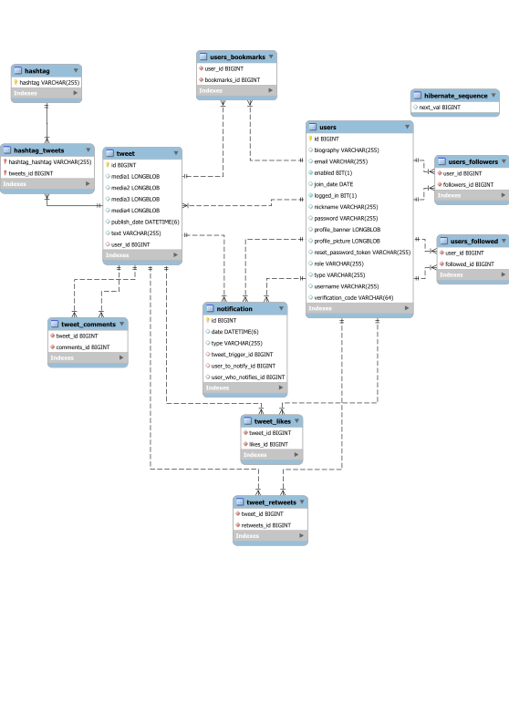

# Twitter Clone

The objetive is to replicated the Social Media Twitter with some upgrades for the user experience.

## :scroll:Table of Contents
* [Phase 0](#hotsprings-phase-0---team-formation-and-features)
    * [Team Members](#hammer-team-members)
    * [Requirements](#bookmark_tabs-requirements)
        * [Entities](#house-entities)
        * [Type of User](#bust_in_silhouette-type-of-user)
        * [User Permissions](#orange_book-user-permissions)
        * [Use Cases](#performing_arts-use-cases)
        * [Non Functional Requirements](#triangular_flag_on_post-non-functional-requirements)
        * [Advanced algorithms](#dart-advanced-algorithms)
* [Phase 1](#triangular_ruler-phase-1---layout)
    * [Screens](#computer-screens)
    * [Navigation Map](#airplane-navigation-map)
* [Phase 2](#satellite-phase-2---web-with-server-generated-html-and-ajax)
    * [Start-up of the application](#black_nib-start-up-of-the-aplication)
    * [DataBase](#card_index-database)
    * [Diagrams](#flower_playing_cards-diagrams)
    * [Members Participation](#busts_in_silhouette-members-participation)

***

## :hotsprings: Phase 0 - Team formation and features

### :hammer: Team Members

| Name                                     | Email                            | Nickname                                           |
| :--------------------------------------: | :------------------------------: | :------------------------------------------------: |
| Sergio de Oro Fernández                  | s.deoro.2021@alumnos.urjc.es     | [@keyland71](https://github.com/keyland71)         |
| Laura María Camino Yuste                 | lm.camino.2020@alumnos.urjc.es   | [@Camyus027](https://github.com/Camyus027)         |
| Antonio José Alanís Bernal               | aj.alanis.2020@alumnos.urjc.es   | [@antonioalanxs](https://github.com/antonioalanxs) |
| Ikár Martínez de Lizarduy Kostornichenko | iv.martinez.2021@alumnos.urjc.es | [@KandV008](https://github.com/KandV008)           |
| Miguel Ángel Sánchez Miranda             | ma.sanchezm.2021@alumnos.urjc.es | [@MiguelAngelSM](https://github.com/MiguelAngelSM) |

To organize the team, we are using [Trello](https://trello.com/b/WpuV8KtM/la-puta-mejor-práctica-de-daw)

### :bookmark_tabs: Requirements

#### :house: Entities

* Tweets
* Hashtags
* User
* Notifications
* Trends

#### :bust_in_silhouette: Type of User

* **Anonymous** &rarr; User which has not signed up in the application but still has access to a few functionalities.
* **Registered** &rarr; User who has already signed up in the application and has a wide variety of available functionalities.
* **Admin** &rarr; User who has the overall control of the platform, having the strongest set of permissions

#### :orange_book: User Permissions

| User           | Tweets                                                            | People                                  | Hashtags                                        | Notifications | Trends |
| :------------: | :---------------------------------------------------------------: | :-------------------------------------: | :---------------------------------------------: | :-----------: | :----: |
| **Anonymous**  | Read                                                              | Read(See their profile)                 | Read (can search them and read the impressions) | Nothing       | Read   |
| **Admin**      | Read, write (their own), detele (every tweet), modify (their own) | Read, delete, write (their own profile) | Read, write, delete                             | Read          | Read   |
| **Registered** | Read, write (their own), delete (their Own), modify (their own)   | Read, write (their own profile)         | Read, write                                     | Read          | Read   |

| Permissions  | Affects to                                                                                                            |
| ------------ | --------------------------------------------------------------------------------------------------------------------- |
| **Images**   | All registered users can upload images                                                                                |
| **Graphics** | All registered users can consult graphics with their statistics (followers evolution, interacts over the past month…) |

| Complementary Technologies                                                                             |
| :----------------------------------------------------------------------------------------------------: |
| Generation of PDFs with all the user's tweets                                                          |
| Python and its libraries to create a ML recommendation systems (Collaborative filtering between users) |
| Generation of a side page on reader mode                                                               |
| [ThreaderApp functionality](https://threadreaderapp.com/thread/1536018200697135106.html)               |

#### :performing_arts: Use Cases

<small>

*Figure 1 - Sign Up and Log In*

*Figure 2 - Admin permissions*

*Figure 3 - General permissions*

*Figure 4 - Registered permissions*

*Figure 5 - User Actions*

</small>

#### :white_check_mark: User Requirements

| Requirements                                                | Anonymous User     | Registered User    | Admin User         |
| :---------------------------------------------------------: | :----------------: | :----------------: | :----------------: |
| Sign up                                                     | :heavy_check_mark: |                    |                    |
| Log in                                                      |                    | :heavy_check_mark: | :heavy_check_mark: |
| See the preview                                             | :heavy_check_mark: |                    |                    |
| Search (using filters)                                      | :heavy_check_mark: | :heavy_check_mark: | :heavy_check_mark: |
| See tweet information                                       | :heavy_check_mark: | :heavy_check_mark: | :heavy_check_mark: |
| Interact with a tweet (retweet, like and comment)           |                    | :heavy_check_mark: | :heavy_check_mark: |
| Reply to a tweet                                            |                    | :heavy_check_mark: | :heavy_check_mark: |
| Cite a tweet                                                |                    | :heavy_check_mark: | :heavy_check_mark: |
| Save a tweet                                                |                    | :heavy_check_mark: | :heavy_check_mark: |
| Write a tweet                                               |                    | :heavy_check_mark: | :heavy_check_mark: |
| Edit a tweet                                                |                    | :heavy_check_mark: | :heavy_check_mark: |
| Delete a tweet                                              |                    | :heavy_check_mark: | :heavy_check_mark: |
| Visualize recommend users                                   | :heavy_check_mark: | :heavy_check_mark: | :heavy_check_mark: |
| Receive notifications                                       |                    | :heavy_check_mark: | :heavy_check_mark: |
| Receive email notifications (when login and sign up)        | :heavy_check_mark: |                    |                    |
| Choose notifications he wants to receive                    |                    | :heavy_check_mark: | :heavy_check_mark: |
| Use Thread Reader                                           |                    | :heavy_check_mark: | :heavy_check_mark: |
| Visualize own statistics                                    |                    | :heavy_check_mark: | :heavy_check_mark: |
| Share a tweet (to another user, out-application)            |                    | :heavy_check_mark: | :heavy_check_mark: |
| Edit profile                                                |                    | :heavy_check_mark: | :heavy_check_mark: |
| Visualize profile                                           | :heavy_check_mark: | :heavy_check_mark: | :heavy_check_mark: |
| Follow a profile                                            |                    | :heavy_check_mark: | :heavy_check_mark: |
| Subscribe a profile (notifications)                         |                    | :heavy_check_mark: | :heavy_check_mark: |
| Visualize tendencies                                        | :heavy_check_mark: | :heavy_check_mark: | :heavy_check_mark: |
| Block a tendency (not visualize tweets within the tendency) |                    | :heavy_check_mark: | :heavy_check_mark: |
| Receive email notifications (when login and sign up)        |                    | :heavy_check_mark: | :heavy_check_mark: |
| Delete profiles                                             |                    |                    | :heavy_check_mark: |
| Ban users                                                   |                    |                    | :heavy_check_mark: |
| Unbanned users                                              |                    |                    | :heavy_check_mark: |
| Delete tweets                                               |                    |                    | :heavy_check_mark: |
| Ban hashtags                                                |                    |                    | :heavy_check_mark: |
| Unbanned users                                              |                    |                    | :heavy_check_mark: |
| Verificate users                                            |                    |                    | :heavy_check_mark: |
| Unverificate user                                           |                    |                    | :heavy_check_mark: |

#### :triangular_flag_on_post: Non Functional Requirements

* Must abide by the law (Of each continent/country in which is it used)
* Supports tweets comprising text and pictures/videos
* Generating the timeline should be fast within half a second (at most)
* Systems must be available at all times (scalability and availability) 
* Data should be durable
* Security must be ensured at all phases
* The size of a tweet is 140 characters at most

#### :dart: Advanced algorithms

* ##### Recommended Systems

    * We will create a python/javascript based system to recommend new profiles and trends to our registered users using collaborative filtering techniques.

* ##### Search

    *  We will create a strong search algorithm able to adapt to the filters that users select to provide an accurate and fast result.

***

## :triangular_ruler: Phase 1 - Layout

### :computer: Screens

<small>

*Figure 6 - index.html*

*Figure 7 - login.html*

*Figure 8 - signup.html*

*Figure 9 - home.html*

*Figure 10 - explore.html*

*Figure 11 - explore-anonymous.html*

*Figure 12 - explore-anonymous-tweets.html*

*Figure 13 - bookmarks.html*

*Figure 14 - notifications.html*

*Figure 15 - profile.html*

*Figure 16 - edit-profile.html*

*Figure 17 - dashboard.html*

*Figure 18 - stats.html*

*Figure 19 - write-tweet.html*

*Figure 20 - reply-tweet.html*

*Figure 21 - error.html*

</small>

### :airplane: Navigation Map

<small>

| Color | User Movement |
| :---: | :-----------: |
| 🔵 | All users |
| 🟢 | Registered Users |
| 🔴 | Admin Users |

#### Main Navigation Map

*Figure 22 - Navigation Map 1*

#### Navigation Map of the Anonymous User

*Figure 23 - Navigation Map 2*

#### Navigation Map of the Admin User

*Figure 24 - Navigation Map 3*

#### New user registration and password recovery Navigation Map 

*Figure 25 - Navigation Map 4*

</small>

***

## :satellite: Phase 2 - Web with server-generated HTML and AJAX

### :black_nib: Start-up of the aplication
#### Steps
1. Download this repository
2. Check Requirements 
3. Configure DataBase
4. Configure IDE
5. Run Application in the IDE
6. Go to https://localhost/8443/

#### DataBase Configuration
- Download MySQL v.8.0.32 --> http://dev.mysql.com/downloads/
- Select default port (3306)
- Create a user with name Admin and password "password" with DB admin as user role
- Configure MySQL Server as Windows Service
- Grant full access to the user
- Create a new Schema named twitter in the server using MySQL Workbench
Note:
If you have selected to not let the server to run when the system starts you can run the server with Windows R and execute the command "services.msc". In the list you can find MySQL server and run it. 

#### IDE Configuration
- We recommend IntelliJ IDEA but you can use other IDE's
- Install Maven and Spring for your IDE
- Add the following enviroment variable --> SPRING_MAIL_PASSWORD=APasswordForTheMail

#### Requirements
- MySQL: v.8.0.32 (Explained in DataBase Configuration)
- Java: JDK 17 --> https://www.oracle.com/java/technologies/javase/jdk17-archive-downloads.html
- IDE (explained in IDE Configuration)

### :card_index: DataBase

*Figure 26 - DataBase*

### :flower_playing_cards: Diagrams

### :busts_in_silhouette: Members Participation

#### Sergio De Oro Fernández

* Creator and controller of all notifications, his great creativity has allowed logical and ingenious solutions.

| Commit | Description |
| :----: | :---------: |
| [1º](https://github.com/CodeURJC-DAW-2022-23/webapp8/tree/3768cc13aa91e8e07bacd1ffe06e3fd8dd286d56)     | Fix tweet's buttons visual           |
| [2º](https://github.com/CodeURJC-DAW-2022-23/webapp8/tree/1ea02a266549d15e627e86671cf6ad6bb3810f9)      | Create and Delete Like notifications           |
| [3º](https://github.com/CodeURJC-DAW-2022-23/webapp8/tree/e3544ed8d6c275f3ca3955afef7cf071ceb8359f)      | Add create and delete notification system           |
| [4º](https://github.com/CodeURJC-DAW-2022-23/webapp8/tree/d53cbd016b685d91330d00e712c598f91442cc7d)      | Show all user-type svg           |
| [5º](https://github.com/CodeURJC-DAW-2022-23/webapp8/tree/d19088352f881d82a8ee3d772be41e93365c76df)      | Add showing notifications            |

#### Laura María Camino Yuste

* Our security scientist has prepared all the security of our application, together with all the logic of registering users and login.

| Commit | Description |
| :----: | :---------: |
| [1º](https://github.com/CodeURJC-DAW-2022-23/webapp8/tree/659bfadd4a7b28969d80f19012322817a0685a41)      | Add Signup Logic           |
| [2º](https://github.com/CodeURJC-DAW-2022-23/webapp8/tree/a427e163f56e2ae87f7e1e11b1ec9551d1ef38c7)      | Fix Login Bug          |
| [3º](https://github.com/CodeURJC-DAW-2022-23/webapp8/tree/f790a17eef5b6e652aa4c775882168751855a3ba)      | Add verify account through email          |
| [4º](https://github.com/CodeURJC-DAW-2022-23/webapp8/tree/7dcddbd22abe9fbd79514002821fefcab2454aa8)      | Add Change Password functionality         |
| [5º](https://github.com/CodeURJC-DAW-2022-23/webapp8/tree/424b562089ab081a17524988596943d4df3d7e87)      | Fix CSRF management          |

#### Antonio José Alanís Bernal

* Main designer artist, he has created the entire visual section of the web application, together with all the logic referring to the profiles of the different users.

| Commit | Description |
| :----: | :---------: |
| [1º](https://github.com/CodeURJC-DAW-2022-23/webapp8/tree/d79cd4872900c9462e98d18cf0de728306a14f95)      | Add AJAX to profile page           |
| [2º](https://github.com/CodeURJC-DAW-2022-23/webapp8/tree/5db370a45051cebf7f91a6c9fcea4f08a7131969)      | Add AJAX to follow page           |
| [3º](https://github.com/CodeURJC-DAW-2022-23/webapp8/tree/1acd14cce631523ee2e558de35f97270acb14c11)      | Add user's tweets to profile           |
| [4º](https://github.com/CodeURJC-DAW-2022-23/webapp8/tree/bcb1b65cac838afed0f26596813e54a0211bc043)     | Add edit profile logic and refactor template           |
| [5º](https://github.com/CodeURJC-DAW-2022-23/webapp8/tree/14bc14bd048baae34b9bd13c837b3673413a0495)      | Show user profile           |

#### Ikár Vladislav Martínez de Lizarduy Kostornichenko

* Worker of the bridge between the front and the backend of the web application, together with the documentation of our website.

| Commit | Description |
| :----: | :---------: |
| [1º](https://github.com/CodeURJC-DAW-2022-23/webapp8/tree/6a243d67b62d7d629f815f250b6273d26885f0d0)      | Conect Front and Back end for trends           |
| [2º](https://github.com/CodeURJC-DAW-2022-23/webapp8/tree/fa2ef6257095eab061411c2ebcaafb323a126e19)      | Add Navigation with Spring           |
| [3º](https://github.com/CodeURJC-DAW-2022-23/webapp8/tree/4fdaf55a26c9a12550aea8607ffc8d0b42422ab8)      | Add tweet creation           |
| [4º](https://github.com/CodeURJC-DAW-2022-23/webapp8/tree/7cc6a246259b5bbc1e6ba1af4b55f316cc375699)      | Add to be able to see tweets associated with a hashtag           |
| [5º](https://github.com/CodeURJC-DAW-2022-23/webapp8/tree/ee6628227241561cc08f54e56400dc6484ad7f78)      | Fix problem with AJAX           |

#### Miguel Ángel Sánchez Miranda

* Manager of everything related to the Database, being the one who most dominates this aspect with his great ability to perform queries.

| Commit | Description |
| :----: | :---------: |
| [1º](https://github.com/CodeURJC-DAW-2022-23/webapp8/tree/36ab7219f97bfc0f8d08d7fd263e11e36a997c73)      | Data Base migration to MySQL           |
| [2º](https://github.com/CodeURJC-DAW-2022-23/webapp8/tree/5bb8d61e3b2fddda4c72f40f7e227fa741f5912e)      | Add Admin dashboard mustache and statics           |
| [3º](https://github.com/CodeURJC-DAW-2022-23/webapp8/tree/d52e49cab7f1d11ef12e9fd7b7aa800aaff93f3a)      | Rework DataBase to fix circular references           |
| [4º](https://github.com/CodeURJC-DAW-2022-23/webapp8/tree/f2413dcc7beb1a50c471210f36c1aea6be090d45)      | Add new queries to Tweet           |
| [5º](https://github.com/CodeURJC-DAW-2022-23/webapp8/tree/34066d1d40a06962bbd767c14ebf71edb4368347)      | Update Hashtag           |

***
