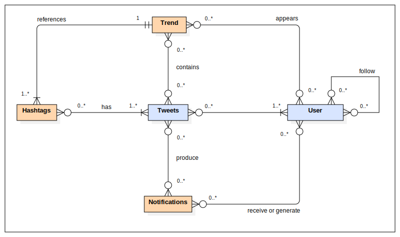

# Twitter Clone

The objetive is to replicated the Social Media Twitter with some upgrades for the user experience.

## :scroll:Table of Contents
* [Phase 0](#hotsprings-phase-0---team-formation-and-features)
    * [Team Members](#hammer-team-members)
    * [Requirements](#bookmark_tabs-requirements)
        * [Entities](#house-entities)
        * [Type of User](#bust_in_silhouette-type-of-user)
        * [User Permissions](#orange_book-user-permissions)
        * [Use Cases](#performing_arts-use-cases)
        * [Non Functional Requirements](#triangular_flag_on_post-non-functional-requirements)
        * [Advanced algorithms](#dart-advanced-algorithms)

***

## :hotsprings: Phase 0 - Team formation and features

### :hammer: Team Members

| Name                                     | Email                            | Nickname                                           |
| :--------------------------------------: | :------------------------------: | :------------------------------------------------: |
| Sergio de Oro Fernández                  | s.deoro.2021@alumnos.urjc.es     | [@keyland71](https://github.com/keyland71)         |
| Laura María Camino Yuste                 | lm.camino.2020@alumnos.urjc.es   | [@Camyus027](https://github.com/Camyus027)         |
| Antonio José Alanís Bernal               | aj.alanis.2020@alumnos.urjc.es   | [@antonioalanxs](https://github.com/antonioalanxs) |
| Ikár Martínez de Lizarduy Kostornichenko | iv.martinez.2021@alumnos.urjc.es | [@KandV008](https://github.com/KandV008)           |
| Miguel Ángel Sánchez Miranda             | ma.sanchezm.2021@alumnos.urjc.es | [@MiguelAngelSM](https://github.com/MiguelAngelSM) |

To organize the team, we are using [Trello](https://trello.com/b/WpuV8KtM/la-puta-mejor-práctica-de-daw)

### :bookmark_tabs: Requirements

#### :house: Entities

* Tweets
* Hashtags
* User
* Notifications
* Trends

#### :bust_in_silhouette: Type of User

* **Anonymous** &rarr; User which has not signed up in the application but still has access to a few functionalities.
* **Registered** &rarr; User who has already signed up in the application and has a wide variety of available functionalities.
* **Admin** &rarr; User who has the overall control of the platform, having the strongest set of permissions

#### :orange_book: User Permissions

| User           | Tweets                                                            | People                                  | Hashtags                                        | Notifications | Trends |
| :------------: | :---------------------------------------------------------------: | :-------------------------------------: | :---------------------------------------------: | :-----------: | :----: |
| **Anonymous**  | Read                                                              | Read(See their profile)                 | Read (can search them and read the impressions) | Nothing       | Read   |
| **Admin**      | Read, write (their own), detele (every tweet), modify (their own) | Read, delete, write (their own profile) | Read, write, delete                             | Read          | Read   |
| **Registered** | Read, write (their own), delete (their Own), modify (their own)   | Read, write (their own profile)         | Read, write                                     | Read          | Read   |

| Permissions  | Affects to                                                                                                            |
| ------------ | --------------------------------------------------------------------------------------------------------------------- |
| **Images**   | All registered users can upload images                                                                                |
| **Graphics** | All registered users can consult graphics with their statistics (followers evolution, interacts over the past month…) |

| Complementary Technologies                                                                             |
| :----------------------------------------------------------------------------------------------------: |
| Generation of PDFs with all the user's tweets                                                          |
| Python and its libraries to create a ML recommendation systems (Collaborative filtering between users) |
| Generation of a side page on reader mode                                                               |
| [ThreaderApp functionality](https://threadreaderapp.com/thread/1536018200697135106.html)               |

#### :performing_arts: Use Cases

<small>

*Figure 1 - Sign Up and Log In*

*Figure 2 - Admin permissions*

*Figure 3 - General permissions*

*Figure 4 - Registered permissions*

*Figure 5 - User Actions*

</small>

#### :white_check_mark: User Requirements

| Requirements                                                | Anonymous User     | Registered User    | Admin User         |
| :---------------------------------------------------------: | :----------------: | :----------------: | :----------------: |
| Sign up                                                     | :heavy_check_mark: |                    |                    |
| Log in                                                      |                    | :heavy_check_mark: | :heavy_check_mark: |
| See the preview                                             | :heavy_check_mark: |                    |                    |
| Search (using filters)                                      | :heavy_check_mark: | :heavy_check_mark: | :heavy_check_mark: |
| See tweet information                                       | :heavy_check_mark: | :heavy_check_mark: | :heavy_check_mark: |
| Interact with a tweet (retweet, like and comment)           |                    | :heavy_check_mark: | :heavy_check_mark: |
| Reply to a tweet                                            |                    | :heavy_check_mark: | :heavy_check_mark: |
| Cite a tweet                                                |                    | :heavy_check_mark: | :heavy_check_mark: |
| Save a tweet                                                |                    | :heavy_check_mark: | :heavy_check_mark: |
| Write a tweet                                               |                    | :heavy_check_mark: | :heavy_check_mark: |
| Edit a tweet                                                |                    | :heavy_check_mark: | :heavy_check_mark: |
| Delete a tweet                                              |                    | :heavy_check_mark: | :heavy_check_mark: |
| Visualize recommend users                                   | :heavy_check_mark: | :heavy_check_mark: | :heavy_check_mark: |
| Receive notifications                                       |                    | :heavy_check_mark: | :heavy_check_mark: |
| Receive email notifications (when login and sign up)        | :heavy_check_mark: |                    |                    |
| Choose notifications he wants to receive                    |                    | :heavy_check_mark: | :heavy_check_mark: |
| Use Thread Reader                                           |                    | :heavy_check_mark: | :heavy_check_mark: |
| Visualize own statistics                                    |                    | :heavy_check_mark: | :heavy_check_mark: |
| Share a tweet (to another user, out-application)            |                    | :heavy_check_mark: | :heavy_check_mark: |
| Edit profile                                                |                    | :heavy_check_mark: | :heavy_check_mark: |
| Visualize profile                                           | :heavy_check_mark: | :heavy_check_mark: | :heavy_check_mark: |
| Follow a profile                                            |                    | :heavy_check_mark: | :heavy_check_mark: |
| Subscribe a profile (notifications)                         |                    | :heavy_check_mark: | :heavy_check_mark: |
| Visualize tendencies                                        | :heavy_check_mark: | :heavy_check_mark: | :heavy_check_mark: |
| Block a tendency (not visualize tweets within the tendency) |                    | :heavy_check_mark: | :heavy_check_mark: |
| Receive email notifications (when login and sign up)        |                    | :heavy_check_mark: | :heavy_check_mark: |
| Delete profiles                                             |                    |                    | :heavy_check_mark: |
| Ban users                                                   |                    |                    | :heavy_check_mark: |
| Unbanned users                                              |                    |                    | :heavy_check_mark: |
| Delete tweets                                               |                    |                    | :heavy_check_mark: |
| Ban hashtags                                                |                    |                    | :heavy_check_mark: |
| Unbanned users                                              |                    |                    | :heavy_check_mark: |
| Verificate users                                            |                    |                    | :heavy_check_mark: |
| Unverificate user                                           |                    |                    | :heavy_check_mark: |

#### :triangular_flag_on_post: Non Functional Requirements

* Must abide by the law (Of each continent/country in which is it used)
* Supports tweets comprising text and pictures/videos
* Generating the timeline should be fast within half a second (at most)
* Systems must be available at all times (scalability and availability) 
* Data should be durable
* Security must be ensured at all phases
* The size of a tweet is 140 characters at most

#### :dart: Advanced algorithms

* ##### Recommended Systems

    * We will create a python/javascript based system to recommend new profiles and trends to our registered users using collaborative filtering techniques.

* ##### Search

    *  We will create a strong search algorithm able to adapt to the filters that users select to provide an accurate and fast result.

***
