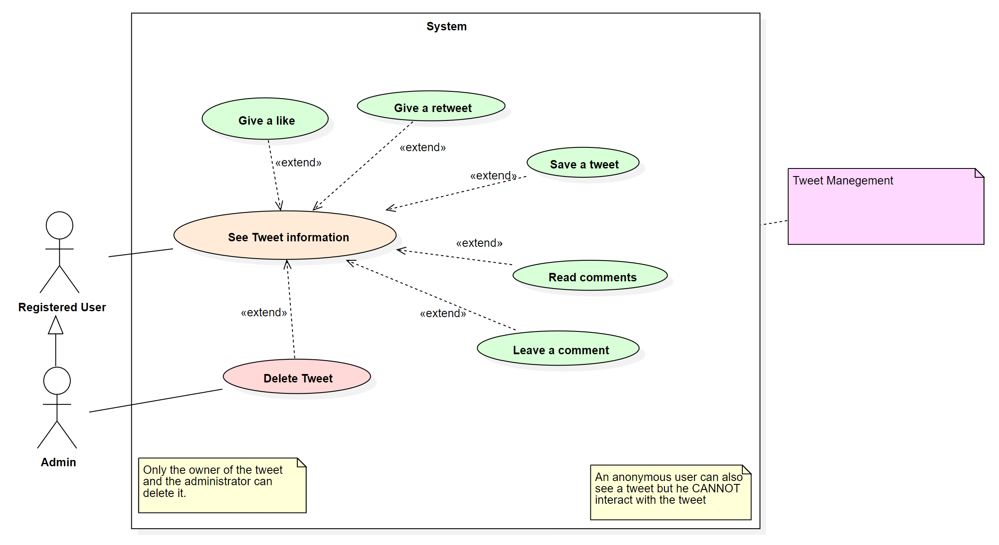

# Twitter Clone

The objetive is to replicated the Social Media Twitter with some upgrades for the user experience.

## :scroll:Table of Contents
* [Phase 0](#hotsprings-phase-0---team-formation-and-features)
    * [Team Members](#hammer-team-members)
    * [Requirements](#bookmark_tabs-requirements)
        * [Entities](#house-entities)
        * [Type of User](#bust_in_silhouette-type-of-user)
        * [User Permissions](#orange_book-user-permissions)
        * [Use Cases](#performing_arts-use-cases)
        * [Non Functional Requirements](#triangular_flag_on_post-non-functional-requirements)
        * [Advanced algorithms](#dart-advanced-algorithms)
* [Phase 1](#triangular_ruler-phase-1---layout)
    * [Screens](#computer-screens)
    * [Navigation Map](#airplane-navigation-map)
* [Phase 2](#satellite-phase-2---web-with-server-generated-html-and-ajax)
    * [Start-up of the application](#black_nib-start-up-of-the-aplication)
        * [Sample User](#closed_lock_with_key-sample-users)
    * [DataBase](#card_index-database)
    * [Diagrams](#flower_playing_cards-diagrams)
    * [Members Participation](#busts_in_silhouette-members-participation---phase-2)
* [Phase 3](#whale2-phase-3---add-a-rest-api-to-the-web-application-and-deploy-withdocker)
    * [API REST documentation](#postbox-api-rest-documentation)
    * [Dockerized application execution instructions](#calling-dockerized-application-execution-instructions)
    * [Documentation for building the docker image](#whale-documentation-for-building-the-docker-image)
    * [Members Participation](#busts_in_silhouette-members-participation---phase-3)


***

## :hotsprings: Phase 0 - Team formation and features

### :hammer: Team Members

| Name                                     | Email                            | Nickname                                           |
| :--------------------------------------: | :------------------------------: | :------------------------------------------------: |
| Sergio de Oro Fernández                  | s.deoro.2021@alumnos.urjc.es     | [@keyland71](https://github.com/keyland71)         |
| Laura María Camino Yuste                 | lm.camino.2020@alumnos.urjc.es   | [@Camyus027](https://github.com/Camyus027)         |
| Antonio José Alanís Bernal               | aj.alanis.2020@alumnos.urjc.es   | [@antonioalanxs](https://github.com/antonioalanxs) |
| Ikár Martínez de Lizarduy Kostornichenko | iv.martinez.2021@alumnos.urjc.es | [@KandV008](https://github.com/KandV008)           |
| Miguel Ángel Sánchez Miranda             | ma.sanchezm.2021@alumnos.urjc.es | [@MiguelAngelSM](https://github.com/MiguelAngelSM) |

To organize the team, we are using [Trello](https://trello.com/b/WpuV8KtM/la-puta-mejor-práctica-de-daw)

### :bookmark_tabs: Requirements

#### :house: Entities

* Tweets
* Hashtags
* User
* Notifications


#### :bust_in_silhouette: Type of User

* **Anonymous** &rarr; User which has not signed up in the application but still has access to a few functionalities.
* **Registered** &rarr; User who has already signed up in the application and has a wide variety of available functionalities.
* **Admin** &rarr; User who has the overall control of the platform, having the strongest set of permissions

#### :orange_book: User Permissions

| User           | Tweets                                        | People                                  | Hashtags                                        | Notifications |
| :------------: | :-------------------------------------------: | :-------------------------------------: | :---------------------------------------------: | :-----------: |
| **Anonymous**  | Read                                          | Read(See their profile)                 | Read (can search them and read the impressions) | Nothing       |
| **Admin**      | Read, write (their own), detele (every tweet) | Read, delete, write (their own profile) | Read, write                                     | Read          |
| **Registered** | Read, write (their own), delete (their Own)   | Read, write (their own profile)         | Read, write                                     | Read          |

| Permissions  | Affects to                                                                                              |
| ------------ | ------------------------------------------------------------------------------------------------------- |
| **Images**   | All registered users can upload images                                                                  |
| **Graphics** | Admin users can consult graphics with the statistics of the web (Number of new registered users)        |

| Complementary Technologies                                       |
| :--------------------------------------------------------------: |
| Mail Sender                                                      |

#### :performing_arts: Use Cases
<div style="display: flex;
            flex-direction: column;
            text-align: center;">
<small>


*Figure 1 - Sign Up and Log In*


*Figure 2 - Admin permissions*


*Figure 3 - General permissions*


*Figure 4 - Registered permissions*


*Figure 5 - User Actions*

</small>
</div>


#### :white_check_mark: User Requirements

| Requirements                                                | Anonymous User     | Registered User    | Admin User         |
| :---------------------------------------------------------: | :----------------: | :----------------: | :----------------: |
| Sign up                                                     | :heavy_check_mark: |                    |                    |
| Log in                                                      |                    | :heavy_check_mark: | :heavy_check_mark: |
| See the preview                                             | :heavy_check_mark: |                    |                    |
| Search (using filters)                                      | :heavy_check_mark: | :heavy_check_mark: | :heavy_check_mark: |
| See tweet information                                       | :heavy_check_mark: | :heavy_check_mark: | :heavy_check_mark: |
| Interact with a tweet (retweet, like and comment)           |                    | :heavy_check_mark: | :heavy_check_mark: |
| Reply to a tweet                                            |                    | :heavy_check_mark: | :heavy_check_mark: |
| Save a tweet                                                |                    | :heavy_check_mark: | :heavy_check_mark: |
| Write a tweet                                               |                    | :heavy_check_mark: | :heavy_check_mark: |
| Delete a tweet                                              |                    | :heavy_check_mark: | :heavy_check_mark: |
| Visualize recommend users                                   | :heavy_check_mark: | :heavy_check_mark: | :heavy_check_mark: |
| Receive notifications                                       |                    | :heavy_check_mark: | :heavy_check_mark: |
| Receive email notifications                                 | :heavy_check_mark: |                    |                    |
| Visualize statistics                                        |                    |                    | :heavy_check_mark: |
| Edit profile                                                |                    | :heavy_check_mark: | :heavy_check_mark: |
| Visualize profile                                           | :heavy_check_mark: | :heavy_check_mark: | :heavy_check_mark: |
| Follow a profile                                            |                    | :heavy_check_mark: | :heavy_check_mark: |
| Visualize tendencies                                        | :heavy_check_mark: | :heavy_check_mark: | :heavy_check_mark: |
| Ban users                                                   |                    |                    | :heavy_check_mark: |
| Unbanned users                                              |                    |                    | :heavy_check_mark: |
| Delete tweets                                               |                    |                    | :heavy_check_mark: |
| Verificate users                                            |                    |                    | :heavy_check_mark: |
| Unverificate user                                           |                    |                    | :heavy_check_mark: |

#### :triangular_flag_on_post: Non Functional Requirements

* Must abide by the law (Of each continent/country in which is it used)
* Supports tweets comprising text and pictures
* Generating the timeline should be fast within half a second (at most)
* Systems must be available at all times (scalability and availability) 
* Data should be durable
* Security must be ensured at all phases
* The size of a tweet is 240 characters at most

#### :dart: Advanced algorithms

* ##### Recommended Systems

    * We will create a SQL query to recommend new profiles to our registered users using collaborative filtering techniques.

* ##### Search

    *  We will create a strong search algorithm able to adapt to the filters that users select to provide an accurate and fast result.

***


## :triangular_ruler: Phase 1 - Layout

### :computer: Screens

<div style="display: flex;
            flex-direction: column;
            text-align: center;">
<small>


*Figure 6 - index.html*


*Figure 7 - login.html*


*Figure 8 - signup.html*


*Figure 9 - home.html*


*Figure 10 - explore.html*


*Figure 11 - explore-anonymous.html*


*Figure 12 - explore-anonymous-tweets.html*


*Figure 13 - bookmarks.html*


*Figure 14 - notifications.html*


*Figure 15 - profile.html*


*Figure 16 - edit-profile.html*


*Figure 17 - dashboard.html*


*Figure 18 - stats.html*


*Figure 19 - write-tweet.html*


*Figure 20 - reply-tweet.html*


*Figure 21 - error.html*


</small>
</div>

### :airplane: Navigation Map

<div style="display: flex;
            flex-direction: column;
            text-align: center;">
<small>

| Color | User Movement |
| :---: | :-----------: |
| 🔵 | All users |
| 🟢 | Registered Users |
| 🔴 | Admin Users |

#### Main Navigation Map


*Figure 22 - Navigation Map 1*

#### Navigation Map of the Anonymous User


*Figure 23 - Navigation Map 2*

#### Navigation Map of the Admin User


*Figure 24 - Navigation Map 3*

#### New user registration and password recovery Navigation Map 


*Figure 25 - Navigation Map 4*

</small>
</div>

***

## :satellite: Phase 2 - Web with server-generated HTML and AJAX

### :black_nib: Start-up of the aplication

#### :feet: Steps

1. Check [Requirements](#requirements)
2. Clone the repository

```
git clone https://github.com/CodeURJC-DAW-2022-23/webapp8.git
cd webapp8
```

3. Configure [DataBase](#database-configuration)
4. Configure [IDE](#ide-configuration)
5. Run Application

```
cd ProjectBackEnd\src\main\java\com\TwitterClone\ProjectBackend
javac ProjectBackendApplication
```

6. Go to [localhost URL](https://localhost/8443/)
7. Use the [default users](#closed_lock_with_key-sample-users) to navigate or create a new user

#### DataBase Configuration
- Download [MySQL v.8.0.32](http://dev.mysql.com/downloads/)

| Section | Value |
| :------: | :---: |
| Port | `3306` |
| User name | `Admin` |
| Password | `password` |

- Create a user with name Admin and password "password" with DB admin as user role
- Configure MySQL Server as Windows Service
- Grant full access to the user
- Create a new Schema named twitter in the server using MySQL Workbench

> Note:
> If you have selected to not let the server to run when the system starts you can run the server with Windows R and execute the command "services.msc". In the list you can find MySQL server and run it. 

#### IDE Configuration
- We recommend [IntelliJ IDEA](https://www.jetbrains.com/idea/) but you can use other IDE's
- Install [Maven](https://maven.apache.org/download.cgi) and [Spring](https://spring.io/projects/spring-boot) for your IDE

| Enviroment Variable |
| :-----------------: |
| SPRING_MAIL_PASSWORD=APasswordForTheMail |
| JWT_SECRET=secret |


#### Requirements

| Requirements |
| :----------: |
| [MySQL v.8.0.32](http://dev.mysql.com/downloads/) |
| [JDK 17](https://www.oracle.com/java/technologies/javase/jdk17-archive-downloads.html) |
| [Spring Boot 2.7.4](https://spring.io/projects/spring-boot) |
| [IDE](#ide-configuration) |

#### :closed_lock_with_key: Sample users

| User               | Username      | Password             |
| :----------------: | :-----------: | :------------------: |
| **@admin**         | admin         | `*adminpass*`        |
| **@user**          | user          | `*pass*`             |
| **@antonioalanxs** | antonioalanxs | `*examplePassword3*` |
| **@Keyland71**     | Keyland71     | `*examplePassword2*` |
| **@ibai**          | ibai          | `*ibai*`             |
| **@Rubiu5**        | Rubiu5        | `*rubius*`           |

### :card_index: DataBase


*Figure 26 - DataBase*

### :flower_playing_cards: Diagrams


*Figure 27 - Class Diagram*

### :busts_in_silhouette: Members Participation - Phase 2

#### Sergio De Oro Fernández

* Creator and controller of all notifications, his great creativity has allowed logical and ingenious solutions.

| #   | Commit      |     | #   | File |
| :-: | :---------: | :-: | :-: | :--: |
| 1º  | [Fix tweet's buttons visual](https://github.com/CodeURJC-DAW-2022-23/webapp8/tree/3768cc13aa91e8e07bacd1ffe06e3fd8dd286d56) | | 1º | [NavigationController.java](https://github.com/CodeURJC-DAW-2022-23/webapp8/blob/main/ProjectBackEnd/src/main/java/com/TwitterClone/ProjectBackend/Controller/NavigationController.java)           |
| 2º  | [Create and Delete Like notifications](https://github.com/CodeURJC-DAW-2022-23/webapp8/tree/1ea02a266549d15e627e86671cf6ad6bb3810f9) | |2º       | [NotificationController.java](https://github.com/CodeURJC-DAW-2022-23/webapp8/blob/main/ProjectBackEnd/src/main/java/com/TwitterClone/ProjectBackend/Controller/NotificationController.java) |
| 3º  | [Add create and delete notification system](https://github.com/CodeURJC-DAW-2022-23/webapp8/tree/e3544ed8d6c275f3ca3955afef7cf071ceb8359f) | | 3º | [NotificationService.java](https://github.com/CodeURJC-DAW-2022-23/webapp8/blob/main/ProjectBackEnd/src/main/java/com/TwitterClone/ProjectBackend/Service/NotificationService.java) |
| 4º  | [Show all user-type svg](https://github.com/CodeURJC-DAW-2022-23/webapp8/tree/d53cbd016b685d91330d00e712c598f91442cc7d) | | 4º | [TweetController.java](https://github.com/CodeURJC-DAW-2022-23/webapp8/blob/main/ProjectBackEnd/src/main/java/com/TwitterClone/ProjectBackend/Controller/TweetController.java) |
| 5º  | [Add showing notifications](https://github.com/CodeURJC-DAW-2022-23/webapp8/tree/d19088352f881d82a8ee3d772be41e93365c76df) | | 5º | [LoadNotificationsAssets.js](https://github.com/CodeURJC-DAW-2022-23/webapp8/blob/main/ProjectBackEnd/src/main/resources/static/assets/js/loadNotificationAssets.js) |

#### Laura María Camino Yuste

* Our security scientist has prepared all the security of our application, together with all the user and session management logic.

| #   | Commit      |     | #   | File |
| :-: | :---------: | :-: | :-: | :--: |
| 1º  | [Add Signup Logic](https://github.com/CodeURJC-DAW-2022-23/webapp8/tree/659bfadd4a7b28969d80f19012322817a0685a41) | | 1º | [WebSecurityConfiguration.java](https://github.com/CodeURJC-DAW-2022-23/webapp8/blob/main/ProjectBackEnd/src/main/java/com/TwitterClone/ProjectBackend/Security/WebSecurityConfig.java) |
| 2º  | [Fix Login Bug](https://github.com/CodeURJC-DAW-2022-23/webapp8/tree/a427e163f56e2ae87f7e1e11b1ec9551d1ef38c7) | |2º | [UserDetailsService.java](https://github.com/CodeURJC-DAW-2022-23/webapp8/blob/main/ProjectBackEnd/src/main/java/com/TwitterClone/ProjectBackend/userManagement/RepositoryUserDetailsService.java) |
| 3º  | [Add verify account through email](https://github.com/CodeURJC-DAW-2022-23/webapp8/tree/f790a17eef5b6e652aa4c775882168751855a3ba) | | 3º | [SingUpController.java](https://github.com/CodeURJC-DAW-2022-23/webapp8/blob/main/ProjectBackEnd/src/main/java/com/TwitterClone/ProjectBackend/Controller/UserSignupController.java) |
| 4º  | [Add Change Password functionality](https://github.com/CodeURJC-DAW-2022-23/webapp8/tree/7dcddbd22abe9fbd79514002821fefcab2454aa8) | | 4º | [UserService.java](https://github.com/CodeURJC-DAW-2022-23/webapp8/blob/main/ProjectBackEnd/src/main/java/com/TwitterClone/ProjectBackend/userManagement/UserService.java) |
| 5º  | [Fix CSRF management](https://github.com/CodeURJC-DAW-2022-23/webapp8/tree/424b562089ab081a17524988596943d4df3d7e87) | | 5º | [ResetPasswordController.java](https://github.com/CodeURJC-DAW-2022-23/webapp8/blob/main/ProjectBackEnd/src/main/java/com/TwitterClone/ProjectBackend/Controller/ResetPasswordController.java) |

#### Antonio José Alanís Bernal

* Main designer artist, he has created the entire visual section of the web application, together with all the logic referring to the profiles of the different users.

| #   | Commit      |     | #   | File |
| :-: | :---------: | :-: | :-: | :--: |
| 1º  | [Add AJAX to profile page](https://github.com/CodeURJC-DAW-2022-23/webapp8/tree/d79cd4872900c9462e98d18cf0de728306a14f95) | | 1º      | [Ajax.js](https://github.com/CodeURJC-DAW-2022-23/webapp8/blob/main/ProjectBackEnd/src/main/resources/static/assets/js/ajax.js)           |
| 2º  | [Add AJAX to follow page](https://github.com/CodeURJC-DAW-2022-23/webapp8/tree/5db370a45051cebf7f91a6c9fcea4f08a7131969)  | |2º       | [NavigationController.java](https://github.com/CodeURJC-DAW-2022-23/webapp8/blob/main/ProjectBackEnd/src/main/java/com/TwitterClone/ProjectBackend/Controller/NavigationController.java)          |
| 3º  | [Add user's tweets to profile](https://github.com/CodeURJC-DAW-2022-23/webapp8/tree/1acd14cce631523ee2e558de35f97270acb14c11) | | 3º     | [ProfileController.java](https://github.com/CodeURJC-DAW-2022-23/webapp8/blob/main/ProjectBackEnd/src/main/java/com/TwitterClone/ProjectBackend/Controller/ProfileController.java)         |
| 4º  | [Add edit profile logic and refactor template](https://github.com/CodeURJC-DAW-2022-23/webapp8/tree/bcb1b65cac838afed0f26596813e54a0211bc043) | | 4º | [UserRepository.java](https://github.com/CodeURJC-DAW-2022-23/webapp8/blob/main/ProjectBackEnd/src/main/java/com/TwitterClone/ProjectBackend/Repository/UserRepository.java)        |
| 5º  | [Show user profile](https://github.com/CodeURJC-DAW-2022-23/webapp8/tree/14bc14bd048baae34b9bd13c837b3673413a0495) | | 5º     | [Profile.html](https://github.com/CodeURJC-DAW-2022-23/webapp8/blob/main/ProjectBackEnd/src/main/resources/static/templates/profile.html)       |

#### Ikár Vladislav Martínez de Lizarduy Kostornichenko

* Worker of the bridge between the front and the backend of the web application, together with the documentation of our website.

| #   | Commit      |     | #   | File |
| :-: | :---------: | :-: | :-: | :--: |
| 1º  | [Conect Front and Back end for trends](https://github.com/CodeURJC-DAW-2022-23/webapp8/tree/6a243d67b62d7d629f815f250b6273d26885f0d0) | | 1º      | [InformationManager.java](https://github.com/CodeURJC-DAW-2022-23/webapp8/blob/main/ProjectBackEnd/src/main/java/com/TwitterClone/ProjectBackend/Model/MustacheObjects/InformationManager.java)           |
| 2º  | [Add Navigation with Spring](https://github.com/CodeURJC-DAW-2022-23/webapp8/tree/fa2ef6257095eab061411c2ebcaafb323a126e19) | |2º       | [Ajax.js](https://github.com/CodeURJC-DAW-2022-23/webapp8/blob/main/ProjectBackEnd/src/main/resources/static/assets/js/ajax.js)          |
| 3º  | [Add tweet creation](https://github.com/CodeURJC-DAW-2022-23/webapp8/tree/4fdaf55a26c9a12550aea8607ffc8d0b42422ab8) | | 3º     | [NavigationController.java](https://github.com/CodeURJC-DAW-2022-23/webapp8/blob/main/ProjectBackEnd/src/main/java/com/TwitterClone/ProjectBackend/Controller/NavigationController.java)         |
| 4º  | [Add to be able to see tweets associated with a hashtag](https://github.com/CodeURJC-DAW-2022-23/webapp8/tree/7cc6a246259b5bbc1e6ba1af4b55f316cc375699) | | 4º | [ImageController.java](https://github.com/CodeURJC-DAW-2022-23/webapp8/blob/main/ProjectBackEnd/src/main/java/com/TwitterClone/ProjectBackend/Controller/ImageController.java)        |
| 5º  | [Fix problem with AJAX](https://github.com/CodeURJC-DAW-2022-23/webapp8/tree/ee6628227241561cc08f54e56400dc6484ad7f78) | | 5º     | [HashtagController.java](https://github.com/CodeURJC-DAW-2022-23/webapp8/blob/main/ProjectBackEnd/src/main/java/com/TwitterClone/ProjectBackend/Controller/HashtagController.java)       |

#### Miguel Ángel Sánchez Miranda

* Manager of everything related to the Database, being the one who most dominates this aspect with his great ability to perform queries.

| #   | Commit      |     | #   | File |
| :-: | :---------: | :-: | :-: | :--: |
| 1º  | [Data Base migration to MySQL](https://github.com/CodeURJC-DAW-2022-23/webapp8/tree/36ab7219f97bfc0f8d08d7fd263e11e36a997c73) | | 1º      | [DatabaseInitializer.java](https://github.com/CodeURJC-DAW-2022-23/webapp8/blob/main/ProjectBackEnd/src/main/java/com/TwitterClone/ProjectBackend/Service/DBInitializer.java)           |
| 2º  | [Add Admin dashboard mustache and statics](https://github.com/CodeURJC-DAW-2022-23/webapp8/tree/5bb8d61e3b2fddda4c72f40f7e227fa741f5912e) | |2º       | [TweetRepository.java](https://github.com/CodeURJC-DAW-2022-23/webapp8/blob/main/ProjectBackEnd/src/main/java/com/TwitterClone/ProjectBackend/Repository/TweetRepository.java)        |
| 3º  | [Rework DataBase to fix circular references](https://github.com/CodeURJC-DAW-2022-23/webapp8/tree/d52e49cab7f1d11ef12e9fd7b7aa800aaff93f3a) | | 3º     | [AdminDashboard.html](https://github.com/CodeURJC-DAW-2022-23/webapp8/blob/main/ProjectBackEnd/src/main/resources/static/templates/admin-dashboard.html)         |
| 4º  | [Add new queries to Tweet](https://github.com/CodeURJC-DAW-2022-23/webapp8/tree/f2413dcc7beb1a50c471210f36c1aea6be090d45) | | 4º | [Tweet.java](https://github.com/CodeURJC-DAW-2022-23/webapp8/blob/main/ProjectBackEnd/src/main/java/com/TwitterClone/ProjectBackend/Model/Tweet.java)        |
| 5º  | [Update Hashtag](https://github.com/CodeURJC-DAW-2022-23/webapp8/tree/34066d1d40a06962bbd767c14ebf71edb4368347) | | 5º     | [TweetService.java](https://github.com/CodeURJC-DAW-2022-23/webapp8/blob/main/ProjectBackEnd/src/main/java/com/TwitterClone/ProjectBackend/Service/TweetService.javajs)       |

***

## :whale2: Phase 3 - Add a REST API to the web application and package with Docker

### :postbox: API REST documentation

| URLs | [api-docs.yaml](./api-docs/api-docs.yaml) | [In Production](https://rawcdn.githack.com/CodeURJC-DAW-2022-23/webapp8/59faf5ae9cb5cd1cef903fc8699f87c77910a045/api-docs/api-docs.html) | [For Developers](https://raw.githack.com/CodeURJC-DAW-2022-23/webapp8/main/api-docs/api-docs.html) |
| :--: | :--: | :-----------: | :------------: | 

### :calling: Dockerized application execution instructions
1. Clone this repository
```
git clone https://github.com/CodeURJC-DAW-2022-23/webapp8.git
```
2. Go to docker folder
```
cd webapp8/ProjectBackEnd/docker
```
3.	Install [Docker](https://docs.docker.com/engine/install/)
4. Run Docker
5. Execute [create_image.sh](https://github.com/CodeURJC-DAW-2022-23/webapp8/blob/main/ProjectBackEnd/docker/create_image.sh) file
```
./create_image.sh
```
6. Open your favorite Internet browser
7. The application will be at [https://localhost:8443](https://localhost:8443) 👌

### :whale: Documentation for building the docker image
1. Create an account on [Dockerhub](https://hub.docker.com/)
2. Clone this repository
```
git clone https://github.com/CodeURJC-DAW-2022-23/webapp8.git
```
3. Go to docker folder
```
cd webapp8/ProjectBackEnd/docker
```
4.	Install [Docker](https://docs.docker.com/engine/install/)
5. Run Docker
6. Connect your account to Docker
7. Execute [build_and_push_image.sh](https://github.com/CodeURJC-DAW-2022-23/webapp8/blob/main/ProjectBackEnd/docker/build_and_push_image.sh) file
```
./build_and_push_image.sh accountName/imageName:version
```

### :busts_in_silhouette: Members Participation - Phase 3

#### Sergio De Oro Fernández

* One of those in charge of Dockerizar, has standardized and formatted the documents associated with the practice thanks to his temperance, allowing to have a uniform work.

| #   | Commit      |     | #   | File |
| :-: | :---------: | :-: | :-: | :--: |
| 1º  | [Reformat AJAX from notifications and hashtags](https://github.com/CodeURJC-DAW-2022-23/webapp8/commit/af6822bc209a2e933e6db77f5a4ef5a3a1e6a9a0) | | 1º      | [DBInitializer.java](https://github.com/CodeURJC-DAW-2022-23/webapp8/blob/main/ProjectBackEnd/src/main/java/com/TwitterClone/ProjectBackend/Service/DBInitializer.java)        |
| 2º  | [Fix followers and followed page](https://github.com/CodeURJC-DAW-2022-23/webapp8/commit/c709b565ff8a341d0d59fdc4fe3fca2dc38c52cc) | | 2º      | [Dockerfile](https://github.com/CodeURJC-DAW-2022-23/webapp8/blob/main/ProjectBackEnd/Dockerfile)        |
| 3º  | [Fix DBInitializer for Docker](https://github.com/CodeURJC-DAW-2022-23/webapp8/commit/5786da6f81ba339e0c194db1adb3fea986f2b969) | | 3º      | [docker-compose.yml](https://github.com/CodeURJC-DAW-2022-23/webapp8/blob/main/ProjectBackEnd/docker/docker-compose.yml)        |
| 4º  | [Add docker-compose file](https://github.com/CodeURJC-DAW-2022-23/webapp8/commit/a6bd6a11493ce4e4c383405916f350d6500d09ce) | | 4º      | [ajax.js](https://github.com/CodeURJC-DAW-2022-23/webapp8/blob/main/ProjectBackEnd/src/main/resources/static/assets/js/ajax.js)        |
| 5º  |[Add Dockerfile](https://github.com/CodeURJC-DAW-2022-23/webapp8/commit/d73722fcf38f62386e38caf9dac366f60eb2a0c1) | | 5º      | [ProfileService.java](https://github.com/CodeURJC-DAW-2022-23/webapp8/blob/main/ProjectBackEnd/src/main/java/com/TwitterClone/ProjectBackend/Service/ProfileService.java)

#### Laura María Camino Yuste

* User protector and member of the REST API creation team, her security management has allowed our future clients not to suffer any data leakage.

| #   | Commit      |     | #   | File |
| :-: | :---------: | :-: | :-: | :--: |
| 1º  | [Finish Rest Security Configuration](https://github.com/CodeURJC-DAW-2022-23/webapp8/commit/8b7fa0564473516e405dac9445fd70ad314bf41a) | | 1º      | [SecurityRestConfig.java](https://github.com/CodeURJC-DAW-2022-23/webapp8/blob/main/ProjectBackEnd/src/main/java/com/TwitterClone/ProjectBackend/Security/RestSecurityConfig.java)        |
| 2º  | [Add UserSignUpRestController](https://github.com/CodeURJC-DAW-2022-23/webapp8/commit/25b3ace3b9ae6b0d9dd027a421dcbc3da0651f5a) | | 2º      | [UserSignUpRestController.java](https://github.com/CodeURJC-DAW-2022-23/webapp8/blob/main/ProjectBackEnd/src/main/java/com/TwitterClone/ProjectBackend/Controller/RestController/SearchRestController.java)        |
| 3º  | [Add SearchRestController](https://github.com/CodeURJC-DAW-2022-23/webapp8/commit/16e69880c03dc914c9fcfcdbe7f111e5b2d26f50) | | 3º      | [SearchRestController.java](https://github.com/CodeURJC-DAW-2022-23/webapp8/blob/main/ProjectBackEnd/src/main/java/com/TwitterClone/ProjectBackend/Controller/RestController/SearchRestController.java)        |
| 4º  | [Add AdminDashBoardRestController](https://github.com/CodeURJC-DAW-2022-23/webapp8/commit/0a746921c17c73c295095984da17c15c489aa4d3) | | 4º      |  [AdminDashboardRestController.java](https://github.com/CodeURJC-DAW-2022-23/webapp8/blob/main/ProjectBackEnd/src/main/java/com/TwitterClone/ProjectBackend/Controller/RestController/AdminDashboardRestController.java)       |
| 5º  | [Add ResetPasswordRestController](https://github.com/CodeURJC-DAW-2022-23/webapp8/commit/ce965349d4472a58b4f8336270d50702b526131b) | | 5º      | [ResetPasswordRestController.java](https://github.com/CodeURJC-DAW-2022-23/webapp8/blob/main/ProjectBackEnd/src/main/java/com/TwitterClone/ProjectBackend/Controller/RestController/ResetPasswordRestController.java)        |

#### Antonio José Alanís Bernal

* Member of the application dockerization team, he has refactored the code to adapt it and allow the permanence of our database.

| #   | Commit      |     | #   | File |
| :-: | :---------: | :-: | :-: | :--: |
| 1º  | [Add Dockerfile](https://github.com/CodeURJC-DAW-2022-23/webapp8/commit/d73722fcf38f62386e38caf9dac366f60eb2a0c1) | | 1º      | [DBInitializer.java](https://github.com/CodeURJC-DAW-2022-23/webapp8/blob/main/ProjectBackEnd/src/main/java/com/TwitterClone/ProjectBackend/Service/DBInitializer.java)        |
| 2º  | [Add docker-compose file](https://github.com/CodeURJC-DAW-2022-23/webapp8/commit/a6bd6a11493ce4e4c383405916f350d6500d09ce) | | 2º      | [Dockerfile](https://github.com/CodeURJC-DAW-2022-23/webapp8/blob/main/ProjectBackEnd/Dockerfile)        |
| 3º  | [Fix DBInitializer for Docker](https://github.com/CodeURJC-DAW-2022-23/webapp8/commit/5786da6f81ba339e0c194db1adb3fea986f2b969) | | 3º      | [docker-compose.yml](https://github.com/CodeURJC-DAW-2022-23/webapp8/blob/main/ProjectBackEnd/docker/docker-compose.yml)        |
| 4º  | [Update build_and_push_image.sh](https://github.com/CodeURJC-DAW-2022-23/webapp8/commit/7c1303601ba08a435afad0c759cc23d8d6e96ec2) | | 4º      | [build_and_push.sh](https://github.com/CodeURJC-DAW-2022-23/webapp8/blob/main/ProjectBackEnd/docker/build_and_push_image.sh)        |
| 5º  | [Update README.md with Docker documentation](https://github.com/CodeURJC-DAW-2022-23/webapp8/commit/e1551b162462e1340afcce8eccc724302bda0c6a) | | 5º      | [create_image.sh](https://github.com/CodeURJC-DAW-2022-23/webapp8/blob/main/ProjectBackEnd/docker/create_image.sh)

#### Ikár Vladislav Martínez de Lizarduy Kostornichenko

* Phase leader and documenter, and member of the REST API team. The extensive knowledge of him has allowed a calm phase and without unforeseen events.

| #   | Commit      |     | #   | File |
| :-: | :---------: | :-: | :-: | :--: |
| 1º  | [Add RestNotificationController](https://github.com/CodeURJC-DAW-2022-23/webapp8/commit/343e8999b583de6998a312ab70a255160e1b2cb4) | | 1º      | [HashtagRestController.java](https://github.com/CodeURJC-DAW-2022-23/webapp8/blob/main/ProjectBackEnd/src/main/java/com/TwitterClone/ProjectBackend/Controller/RestController/RestHashtagController.java)        |
| 2º  | [Add RestHashtagController](https://github.com/CodeURJC-DAW-2022-23/webapp8/commit/01f8d2ab6945ab323e5813a6f09c565b44ff84b0) | | 2º      | [ImageRestController.java](https://github.com/CodeURJC-DAW-2022-23/webapp8/blob/main/ProjectBackEnd/src/main/java/com/TwitterClone/ProjectBackend/Controller/RestController/RestImageController.java)        |
| 3º  | [Add RestImageController](https://github.com/CodeURJC-DAW-2022-23/webapp8/commit/78e7a9ae5e5290290d2d96ca60141bccfc7805ed) | | 3º      | [NotificationRestController.java](https://github.com/CodeURJC-DAW-2022-23/webapp8/blob/main/ProjectBackEnd/src/main/java/com/TwitterClone/ProjectBackend/Controller/RestController/RestNotificationController.java)        |
| 4º  | [Add API REST documentation](https://github.com/CodeURJC-DAW-2022-23/webapp8/commit/59faf5ae9cb5cd1cef903fc8699f87c77910a045) | | 4º      | [UserInformation.java](https://github.com/CodeURJC-DAW-2022-23/webapp8/blob/main/ProjectBackend/src/main/java/com/TwitterClone/ProjectBackend/Model/MustacheObjects/UserInformation.java)        |
| 5º  | [Add all API REST petitions from PostMan](https://github.com/CodeURJC-DAW-2022-23/webapp8/commit/d642ae2a9490fcd7b349ef3625ed9240bf4e3a2d) | | 5º      | [Twitter's Clone.postman_collection.json](https://github.com/CodeURJC-DAW-2022-23/webapp8/blob/main/Twitter's%20Clone.postman_collection.json)        |

#### Miguel Ángel Sánchez Miranda

* Database analyst and one of the creators of the Twitter clone REST API, his extensive knowledge in information management has allowed there to be no problems when creating the files that are sent by the API.

| #   | Commit      |     | #   | File |
| :-: | :---------: | :-: | :-: | :--: |
| 1º  | [Add Profile Methods for API](https://github.com/CodeURJC-DAW-2022-23/webapp8/commit/d8c17f1d925f6888b023e54daf9719c31d7d5393) | | 1º | [TweetRestController.java](https://github.com/CodeURJC-DAW-2022-23/webapp8/blob/main/ProjectBackEnd/src/main/java/com/TwitterClone/ProjectBackend/Controller/RestController/RestTweetController.java)       |
| 2º  | [Add Post methods to RestTweetController](https://github.com/CodeURJC-DAW-2022-23/webapp8/commit/dc0d39ec73e47159ad8472f97fb5efc480e87d6e) | | 2º      | [ProfileRestController.java](https://github.com/CodeURJC-DAW-2022-23/webapp8/blob/main/ProjectBackEnd/src/main/java/com/TwitterClone/ProjectBackend/Controller/RestController/RestProfileController.java)         |
| 3º  | [Add GET methods to RestTweetController](https://github.com/CodeURJC-DAW-2022-23/webapp8/commit/13744c51e08907a52d8386c25bc7790c46cd2aa3) | | 3º      | [AdminDashboardRestController.java](https://github.com/CodeURJC-DAW-2022-23/webapp8/blob/main/ProjectBackEnd/src/main/java/com/TwitterClone/ProjectBackend/Controller/RestController/AdminDashboardRestController.java)       |
| 4º  | [Add PUT methods to RestTweetController](https://github.com/CodeURJC-DAW-2022-23/webapp8/commit/19155004768819853760d550ab71021e870618e1) | | 4º      | [Tweet.java](https://github.com/CodeURJC-DAW-2022-23/webapp8/blob/main/ProjectBackEnd/src/main/java/com/TwitterClone/ProjectBackend/Model/Tweet.java)        |
| 5º  | [Create JsonViews](https://github.com/CodeURJC-DAW-2022-23/webapp8/commit/cbf5175dab165666b5afe1f7629d33d57d9a3a8f) | | 5º      | [TweetController.java](https://github.com/CodeURJC-DAW-2022-23/webapp8/blob/main/ProjectBackEnd/src/main/java/com/TwitterClone/ProjectBackend/Controller/TweetController.java)        |

***
